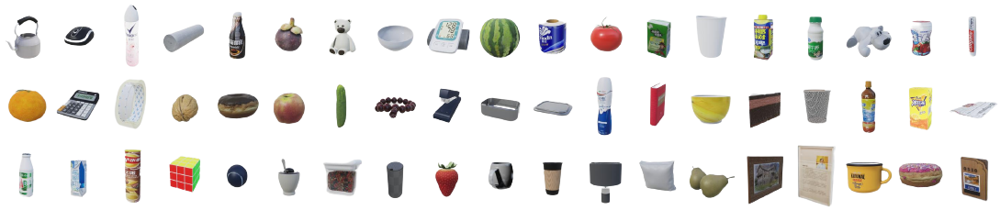

# Simulator

- [Simulator](#simulator)
  - [Scene](#scene)
  - [Getting Started](#getting-started)
    - [Launch Simulator](#launch-simulator)
    - [Installation](#installation)
    - [Quick Start](#quick-start)
  - [Tasks](#tasks)
  - [Observation and Action Space](#observation-and-action-space)
  - [Joints](#joints)
    - [Joints Information](#joints-information)
    - [Joints Range](#joints-range)
  - [API using](#api-using)
  - [Appendix](#appendix)
    - [API Details](#api-details)
      - [Communication Protocol](#communication-protocol)
      - [Data Types](#data-types)
    - [List of objects could be generated](#list-of-objects-could-be-generated)
## Scene
<div align=center>
  
</div>

<div align=center>
  
</div>

High-resolution rendering of the digital twin scene.

https://github.com/Necolizer/RM-PRT/assets/58028682/02fc70c6-a636-4fdc-90e5-4d6010bff0f2

Examples of robotic manipulation in our RM-PRT simulator.

## Getting Started
### Launch Simulator
<details>
<summary> Devices with graphical interfaces </summary>
    Run the appropriate executable file in Windows or Linux.
</details>

<details>
<summary> Devices without graphical interfaces </summary>

- **Verifying GitHub Access[^1]**

  Verify that you can access the Unreal Engine source code repository on GitHub: https://github.com/EpicGames/UnrealEngine. If you cannot access the repository then you will need to [link your GitHub account with your Epic Games Account](https://www.unrealengine.com/en-US/ue-on-github).
- **Authenticating with GitHub Container Registry**
  
  To download container images from GitHub Container Registry using Docker you will need to authenticate using a personal access token. If you do not already have a personal access token with the `read:packages` scope then you will need to [follow the steps to create one](https://docs.github.com/en/github/authenticating-to-github/keeping-your-account-and-data-secure/creating-a-personal-access-token).

  Once you have created a personal access token with the required scope, use the `docker login` command to authenticate with GitHub Container Registry as described in the [instructions from GitHub](https://docs.github.com/en/packages/working-with-a-github-packages-registry/working-with-the-container-registry#authenticating-to-the-container-registry). This command will need to be run from the command-line interface。
  
  Once you have opened the command-line prompt then run the command shown below, replacing `ACCESS_TOKEN` with your personal access token and `USERNAME` with your GitHub username:
  
  ```bash
  echo ACCESS_TOKEN | docker login ghcr.io -u USERNAME --password-stdin
  ```
  
  If the authentication process was successful then you should see the message *"Login Succeeded"* displayed.

- **Pulling Prebuilt Container Images**

  The official prebuilt container images for Unreal Engine are stored as image tags in the [ghcr.io/epicgames/unreal-engine](https://ghcr.io/epicgames/unreal-engine) repository. To download the Linux development image for Unreal Engine 4.27, use the `docker pull` command shown below:
  
  ```bash
  docker pull ghcr.io/epicgames/unreal-engine:dev-4.27
  ```
  
  This will download a container image that encapsulates the files for Unreal Editor and build tools, which are quite large. Depending on the speed of your internet connection, the download process may take some time. When the download is complete, you should see the message *"Status: Downloaded newer image for ghcr.io/epicgames/unreal-engine:dev-4.27"* displayed.

- **Building the Container**

  Use the following docker file code to create a new one to run.

- **Dockerfile**

  ```bash
  FROM ghcr.io/epicgames/unreal-engine:runtime-pixel-streaming
  
  COPY --chown=ue5:ue5 LinuxClient path/to/LinuxClient
  
  ENV NVIDIA_DRIVER_CAPABILITIES all
  
  ENTRYPOINT ["bin/bash", "/path/to/LinuxClient/GrabSimClient.sh", "-RenderOffScreen"]
  CMD []
  ```

- **Create Image**
  
  ```bash
  docker build -t name .
  ```

- **Create a container**

  ```bash
  nvidia-docker run -it -p 30001:30001 --name sim30001 name:latest
  ```
  
  [^1]: https://docs.unrealengine.com/5.0/en-US/quick-start-guide-for-using-container-images-in-unreal-engine/
  </details>


### Installation

```bash
pip install gym==0.21.0 protobuf==3.20.0 grpcio==1.53.0
```
### Quick Start
Here is a basic example of how to create an environment under our simulator.
```bash
import argparse
import gym
from gym import spaces

from google.protobuf import message
import grpc
import GrabSim_pb2_grpc
import GrabSim_pb2

parser = argparse.ArgumentParser()
parser.add_argument("--host", type=str,default="localhost:30001")
parser.add_argument("--action_nums", type=int,default=7)
args, opts = parser.parse_known_args()

from SimEnv4 import SimEnv
client=args.host

action_nums=args.action_nums
bins = 32
level=1

use_image = True
max_steps = 160

env=SimEnv(client,0,action_nums=action_nums,bins=bins,use_image=use_image,max_steps = max_steps,level=level)
```
## Tasks
- Level 1: The scene contains only one object, and the robot receives explicit machine language commands consisting of a *verbs + nouns*, *e.g.*, to grasp the glass. 
- Level 2: Compared with Level 1, the scene contains multiple objects at this time, and the robot needs to grasp the target object from multiple objects according to the instructions. 
- Level 3: On the basis of Level 2, the robot receives concise human natural language, and the instruction contains the target object that needs to be grasped. 
- Level 4: Compared with Level 3, Level 4's natural language instructions are more ambiguous. It does not clearly point out the target object to be grasped but requires the robot to fully understand human intentions and grasp the corresponding target object according to the scene and instructions.

## Observation and Action Space
```bash
env.observation_space

>>> {
    "head_rgbd": Box(0, 255, shape=(h, w, 4), dtype=np.float64),
    
    "instruction": Box([0,0], [1e5,1e5],  dtype=np.int32),
    
    "state": Box(-inf, inf,  shape=(28), dtype=np.float64),
}
```
```bash
env.action_space

>>> {
    "back": Box(-45, 45, dtype=np.float64),
    
    "right_hand": Box([-180,-90,-90,-120,-90,-23,-23], [36,23,90,12,90,23,36],  dtype=np.float64),
    
    "grasp": Box(0, 1,   dtype=np.int32),
}
```
## Joints
### Joints Information

| JointName | Name                | PositiveDirection |
| --------- | ------------------- | ----------------- |
| 0         | Knee_X_Anchorn      | forward           |
| 1         | Back_Z_Anchorn      | left              |
| 2         | Back_X_Anchorn      | forward           |
| 3         | Back_Y_Anchorn      | right             |
| 4         | Neck_Z_Anchorn      | left              |
| 5         | Neck_X_Anchorn      | down              |
| 6         | Head_Y_Anchorn      | right             |
| 7         | LShlouder_X_Anchorn | back              |
| 8         | LShlouder_Y_Anchorn | out               |
| 9         | LElbow_Z_Anchorn    | out               |
| 10        | LElbow_X_Anchorn    | back              |
| 11        | LWrist_Z_Anchorn    | out               |
| 12        | LWrist_X_Anchorn    | back              |
| 13        | LWrist_Y_Anchorn    | out               |
| 14        | RShlouder_X_Anchorn | back              |
| 15        | RShlouder_Y_Anchorn | in                |
| 16        | RElbow_Z_Anchorn    | in                |
| 17        | RElbow_X_Anchorn    | back              |
| 18        | RWrist_Z_Anchorn    | in                |
| 19        | RWrist_X_Anchorn    | back              |
| 20        | RWrist_Y_Anchorn    | in                |

### Joints Range 

  ```bash
  joints_arrange/° = [
  [-36,30], 
  [-90,90], 
  [-45,45], 
  [-45,45], 
  [-180,180],
  [-45,36], 
  [-23,23], 
  
  # left hand
  [-180,36], 
  [-23,90], 
  [-90,90], 
  [-120,12], 
  [-90,90], 
  [-23,23], 
  [-36,23],
  
  #right hand
  [-180,36],
  [-90,23], 
  [-90,90],
  [-120,12], 
  [-90,90],
  [-23,23],
  [-23,36], 
  ]
  ```

</detail>


## API using
**Connect to the simulator**

```bash
channel = grpc.insecure_channel('127.0.0.1:30001')  # FIXME
channel = grpc.insecure_channel(client,options=[
          ('grpc.max_send_message_length', 1024*1024*1024),
          ('grpc.max_receive_message_length', 1024*1024*1024)
      ])
stub=GrabSim_pb2_grpc.GrabSimStub(channel)
```
**Init the world**

```bash
initworld = stub.Init(GrabSim_pb2.Count(value = value)) # value present the number of scene 
```
**Reset the scene**

```bash
stub.Reset(GrabSim_pb2.ResetParams(sceneID=sceneID)) #sceneID start from 0
```
**Get observation of the scene and show env info**

```bash
scene = stub.Observe(GrabSim_pb2.SceneID(value=sceneID))
print('------------------show_env_info----------------------')
print(f"sceneID:{scene.sceneID}, location:{[scene.location.X, scene.location.Y]}, rotation:{scene.rotation}\n",
      f"joints number:{len(scene.joints)}\n")
```
**Get the images**

```bash
caremras=[GrabSim_pb2.CameraName.Head_Color,GrabSim_pb2.CameraName.Head_Depth]
action = GrabSim_pb2.CameraList(sceneID=sceneID, cameras=caremras)
images = stub.Capture(action).images
```
**Do action**

```bash
stub.Do(GrabSim_pb2.Action(sceneID=sceneID, action = GrabSim_pb2.Action.ActionType.WalkTo,values = [x, y, Yaw, q, v])) # walk
stub.Do(GrabSim_pb2.Action(sceneID=sceneID, action = GrabSim_pb2.Action.ActionType.RotateJoints,values = joints)) # changeJoints
stub.Do(GrabSim_pb2.Action(sceneID=sceneID, action=GrabSim_pb2.Action.Grasp,values=[0])) # control robot hand to grasp, 0 is left hand, 1 is right hand
stub.Do(GrabSim_pb2.Action(sceneID=sceneID, action=GrabSim_pb2.Action.Release,values=[0])) # release robot hand, 0 is left hand, 1 is right hand
```
**Make Objects**

```bash
obj_list = [
        GrabSim_pb2.ObjectList.Object(x=x, y=y, yaw=yaw, z=desk_h, type=obj_id),
    ]
scene = stub.MakeObjects(GrabSim_pb2.ObjectList(objects=obj_list, sceneID=sceneID))
```
**Clean Objects**

```bash
stub.CleanObjects(GrabSim_pb2.SceneID(value=sceneID))
```

## Appendix

### API Details

#### Communication Protocol

- **Protocol**: gRPC
- **Port**: 30001

#### Data Types

- **Count**

  | Field | Type  | Value | Description               |
  | ----- | ----- | ----- | ------------------------- |
  | value | int32 | (0)   | Number of scenes in world |

- **Nothing**

  No content, used when interface does not need input or output values.

- **SceneID**

  | Field | Type  | Value | Description |
  | ----- | ----- | ----- | ----------- |
  | value | int32 | (0)   | Scene ID    |

  Meaning of scene ID:
  
  - 3 : Coffee, 
  - 4 : Restaurant, 
  - 5 : Nurse home

- **World**

  | Field  | Type       | Description                              |
  | ------ | ---------- | ---------------------------------------- |
  | scenes | list/Scene | All scenes in world                      |
  | error  | string     | Partial error information from execution |

- **ResetParams** 

  | Field  | Type  | Value      | Description                                |
  | ------ | ----- | ---------- | ------------------------------------------ |
  | scene  | int32 | (0)        | Target scene ID                            |
  | adjust | bool  | (False)    | Set to True for init params to take effect |
  | height | float | 78.5~111.5 | (90.4) Table height                        |
  | width  | float | 50~150     | (107.4) Table width                        |

- **Object**

  | Field    | Type     | Description     |
  | -------- | -------- | --------------- |
  | name     | string   | Object name     |
  | location | Location | Object position |
  | rotation | Rotation | Object rotation |

- **Location** 

  | Field | Type  | Description  |
  | ----- | ----- | ------------ |
  | X     | float | X coordinate |
  | Y     | float | Y coordinate |
  | Z     | float | Z coordinate |

- **Rotation**

  | Field | Type  | Description               |
  | ----- | ----- | ------------------------- |
  | angle | float | Rotation angle in degrees |

- **MakeObjects**

  | Field   | Type        | Value   | Description                                  |
  | ------- | ----------- | ------- | -------------------------------------------- |
  | scene   | int32       | (0)     | Target scene ID                              |
  | append  | bool        | (False) | Set to append objects or clear existing ones |
  | objects | list/Object |         | List of objects                              |

- **ObjectList.Object**

  | Field | Type  | Value | Description                          |
  | ----- | ----- | ----- | ------------------------------------ |
  | x, y  | float | (0)   | Object position, height at table top |
  | type  | int   |       | Object ID                            |

- **RemoveObjects**

  | Field     | Type       | Value | Description                       |
  | --------- | ---------- | ----- | --------------------------------- |
  | sceneID   | int32      | (0)   | Target scene ID                   |
  | objectIDs | list/int32 |       | Index of objects in Scene.Objects |

- **Action**

  | Field   | Type       | Value             | Description     |
  | ------- | ---------- | ----------------- | --------------- |
  | sceneID | int32      | (0)               | Target scene ID |
  | action  | enum       | Action.ActionType | (RotateJoints)  |
  | values  | list/float | ([0, ...])        |                 |

  Action types:
  
  - WalkTo: Adjust robot position, 3 params  
  - Grasp: Control grasping, left/right hand in values
  - Release: Control releasing, left/right hand in values
  - Move: Control joint angles, 21 params in values

- **Joint**
  
  | Field    | Type     | Description    |
  | -------- | -------- | -------------- |
  | name     | string   | Joint name     |
  | location | Location | Joint position |
  | rotation | Rotation | Joint rotation |

- **Scene**

  | Field     | Type              | Description                                                  |
  | --------- | ----------------- | ------------------------------------------------------------ |
  | sceneID   | int32             | Scene ID                                                     |
  | location  | Location          | Robot coordinates (center of workspace, Scene coordinate system) |
  | rotation  | Rotation          | Robot rotation angles                                        |
  | joints    | list/Scene.Joint  | Pose information for robot joints                            |
  | fingers   | list/Scene.Finger | Pose information for robot finger joints                     |
  | objects   | list/Scene.Object | Position and info of all objects in scene. First object is table, last few are hands with no position info |
  | timestamp | int64             | Nanoseconds since 1970/1/1                                   |
  | error     | string            | Partial error information from execution                     |

- **Scene.Joint**

  | Field    | Type     | Description    |
  | -------- | -------- | -------------- |
  | name     | string   | Joint name     |
  | location | Location | Joint position |
  | angle    | float    | Joint angle    |

- **Scene.Finger**

  | Field    | Type          | Description                          |
  | -------- | ------------- | ------------------------------------ |
  | name     | string        | Finger name                          |
  | location | list/Location | Position of each joint of the finger |
  | angle    | float         | Joint angle                          |

- **Scene.Object**

  | Field    | Type                     | Description                       |
  | -------- | ------------------------ | --------------------------------- |
  | name     | string                   | Object name                       |
  | location | Location                 | Object position                   |
  | rotation | Rotation                 | Object rotation angle (-180, 180) |
  | boxes    | list/Object.Box.Diagonal | Bounding boxes of object          |

- **Pose**

  | Field     | Type        | Description              |
  | --------- | ----------- | ------------------------ |
  | timestamp | int64       | Timestamp in nanoseconds |
  | joints    | list[Joint] | Robot joint poses        |

- **MakeObjects**

  | Field   | Type        | Value   | Description                                  |
  | ------- | ----------- | ------- | -------------------------------------------- |
  | scene   | int32       | (0)     | Target scene ID                              |
  | append  | bool        | (False) | Set to append objects or clear existing ones |
  | objects | list/Object |         | List of objects                              |

- **ObjectList.Object**

  | Field | Type  | Value | Description                          |
  | ----- | ----- | ----- | ------------------------------------ |
  | x, y  | float | (0)   | Object position, height at table top |
  | type  | int   |       | Object ID                            |

- **RemoveObjects**

  | Field     | Type       | Value | Description                       |
  | --------- | ---------- | ----- | --------------------------------- |
  | sceneID   | int32      | (0)   | Target scene ID                   |
  | objectIDs | list/int32 |       | Index of objects in Scene.Objects |

- **Move**

  | Field    | Type  | Description                                            |
  | -------- | ----- | ------------------------------------------------------ |
  | x        | float | Robot x coordinate                                     |
  | y        | float | Robot y coordinate                                     |
  | angle    | float | Robot current angle                                    |
  | speed    | float | Robot moving speed in facing direction, cm/s           |
  | rotating | float | Robot rotation speed, degrees/s, positive is clockwise |

- **CameraList**

  | Field   | Type      | Description     |
  | ------- | --------- | --------------- |
  | sceneID | int32     | Target scene ID |
  | cameras | list/enum | CameraName      |

  CameraName:
  
  - Head_Color: Head RGB camera
  - Head_Depth: Head depth camera  
  - Head_Segment: Head Segment camera  
  - Chest_Color: Chest RGB camera
  - Waist_Color: Waist RGB camera
  - Waist_Depth: Waist depth camera

- **CameraData**

  | Field     | Type                  | Description                |
  | --------- | --------------------- | -------------------------- |
  | images    | list/CameraData.Image | Image data                 |
  | timestamp | int64                 | Nanoseconds since 1970/1/1 |

- **CameraData.Image**

  | Field      | Type                        | Description                       |
  | ---------- | --------------------------- | --------------------------------- |
  | name       | string                      | Camera name                       |
  | data       | bytes                       | Byte array                        |
  | dtype      | string                      | Data format (uint8, float16, etc) |
  | location   | Location                    | Camera position                   |
  | rotation   | Rotation                    | Camera rotation angles            |
  | width      | int                         | Image width                       |
  | height     | int                         | Image height                      |
  | channels   | int                         | Number of channels                |
  | parameters | CamaraData.Image.Parameters | Camera intrinsics                 |

- **CameraData.Image.Parameters**

  | Field  | Type        | Description                                                  |
  | ------ | ----------- | ------------------------------------------------------------ |
  | fx     | float       |                                                              |
  | fy     | float       |                                                              |
  | cx     | float       |                                                              |
  | cy     | float       |                                                              |
  | matrix | array/float | Transform matrix from camera to robot coordinates (4x4, flattened) |

### List of objects could be generated



- The list of object categories in the restaurant scene is shown in [categories.txt](https://github.com/Necolizer/RM-PRT/blob/main/Env/total_objs.txt).
