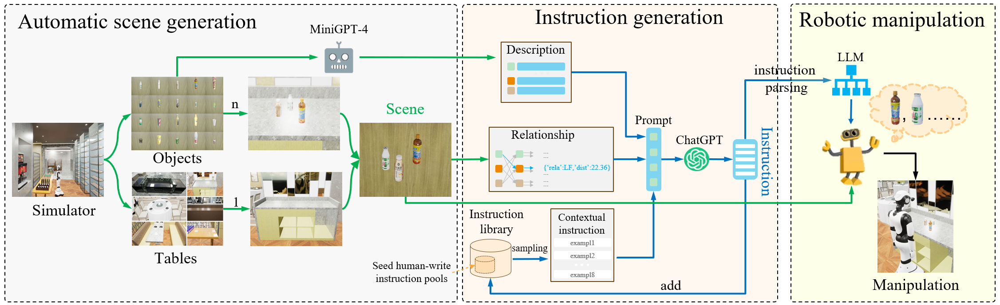

# RM-PRT: Realistic Robotic Manipulation Simulator and Benchmark with Progressive Reasoning Tasks
[[arXiv]](https://arxiv.org/abs/2306.11335) [[Website]](https://necolizer.github.io/RM-PRT/).

## To Do
- [ ] Integrate the physical simulation tool Mujoco into UE5.
- [ ] Support more skills: pulling, pushing, pressing buttons, placing, opening/closing doors, etc.
- [ ] Support more scenarios: retirement homes, coffee shops, etc. Currently, these scenes are already [online](https://necolizer.github.io/RM-PRT/), and corresponding interactive functions will be added.

## Updates
<details>
<summary> 8/13/2023: Release RM-PRT v1.0.0. </summary>
   
🚀🚀 We have released the first version [1.0.0](https://github.com/Necolizer/RM-PRT/releases/tag/v1.0.0) of the RM-PRT benchmark simulator.   
   
   - Built on UE5.
   - Supports [instruction tasks](https://github.com/Necolizer/RM-PRT/blob/main/Env/README.md#tasks) with 4 different difficulty levels.
   - Skill Library: Grab.
   - Scene: Restaurant.
     
</details>

## Introduction
**RM-PRT** is a Robotic Manipulation with Progressive Reasoning Tasks benchmark based on a realistic robotic manipulation simulator. Specifically, the RM-PRT benchmark builds a new high-fidelity digital twin scene based on Unreal Engine 5, which includes 15K natural language instructions generated by ChatGPT for a detailed evaluation of robot manipulation.


## Pipeline



## Environment
### Resource Consumption
In our experiments, we used 1 NVIDIA GeForce RTX 3090 GPU. And the simulator occupies approximately 2 to 3GB of GPU memory.
### Simulator
See [simulator details](https://github.com/Necolizer/RM-PRT/blob/main/Env/README.md).

## Getting Started

```bash
git clone -b main https://github.com/Necolizer/RM-PRT.git
```

First download the [simulator](https://drive.google.com/drive/folders/1jLXAU9eHE6rcpLtohepGlb654mUbA4KR?usp=sharing) and open it on your computer. Then download a [model checkpoint](https://drive.google.com/file/d/1shH1DV6_rrq7hS6Zn0LrfT7LXbDQt3Us/view?usp=drive_link).

Run the inference code.
```bash
python inference.py --host=localhost:30001 --action_nums=8
```
-[BCZ](https://github.com/Necolizer/RM-PRT/edit/main/README.md)
-[Gato](https://github.com/Necolizer/RM-PRT/edit/main/README.md)
-[RT-1](https://github.com/Necolizer/RM-PRT/edit/main/README.md)
-[RT-LP](https://github.com/Necolizer/RM-PRT/edit/main/README.md)

## Available Baselines

## Citation
```
@article{rmprt2023,
      title={RM-PRT: Realistic Robotic Manipulation Simulator and Benchmark with Progressive Reasoning Tasks}, 
      author={Pengzhen Ren and Kaidong Zhang and Hetao Zheng and Zixuan Li and Yuhang Wen and Fengda Zhu and Mas Ma and Xiaodan Liang},
      year={2023},
      journal={arXiv:2306.11335}
}
```

## License

This repository is released under the Apache 2.0 license as found in the [LICENSE](LICENSE.md) file.
